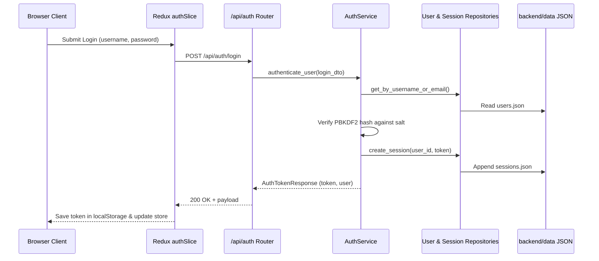

# Authentication & User Management — Architecture

## Overview

The authentication subsystem handles identity, credential security, token issuance, and authorization guards across both backend and frontend layers.

## Backend Layer Design

- **Models**:
  - `UserInDb`: `id`, `username`, `email`, `password_hash`, `salt`, `bio`, `created_at`, `updated_at`.
  - `SessionInDb`: `token`, `user_id`, `created_at`, `expires_at`.
  - `UserRegister`, `UserLogin`, `UserResponse`, `UserProfileUpdate`, `AuthTokenResponse`.
- **Security**:
  - `hashlib.pbkdf2_hmac("sha256", password.encode(), salt_bytes, 100_000).hex()`
  - Salt generated with `secrets.token_hex(16)`.
  - Token generated with `secrets.token_urlsafe(32)`.
- **Dependency Injection**:
  - `get_current_user(authorization: str = Header(...))` extracts Bearer token, validates against `SessionRepository`, returns `UserInDb` or raises `HTTPException(401)`.
  - `get_optional_user` allows public endpoints (e.g. catalog) to identify authenticated users when present.

## Frontend Layer Design

- **Redux Slice (`authSlice`)**:
  - State: `token: string | null`, `user: User | null`, `isAuthenticated: boolean`, `status: 'idle' | 'loading' | 'failed'`.
  - On app start, reads token from `localStorage` and triggers `authApi.endpoints.getMe`.
- **API (`authApi`)**:
  - RTK Query injecting Bearer tokens into headers via `baseQuery`.
  - Endpoints: `register`, `login`, `logout`, `getMe`, `updateProfile`.

