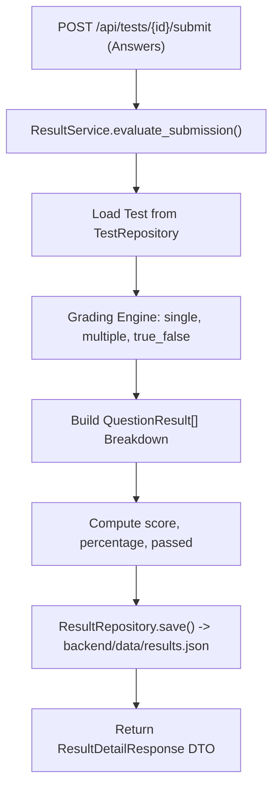

# Test Evaluation & Results — Architecture

## Overview

The evaluation subsystem handles grading algorithms, score aggregation, and persistent test attempt records.



## Grading Algorithm

```python
score = 0
breakdown = []
for q in test.questions:
    user_ans = answer_map.get(q.id, [])
    is_correct = False
    
    if q.question_type in (QuestionType.SINGLE_CHOICE, QuestionType.TRUE_FALSE):
        is_correct = len(user_ans) == 1 and user_ans[0] in q.correct_answers
    elif q.question_type == QuestionType.MULTIPLE_CHOICE:
        is_correct = set(user_ans) == set(q.correct_answers) and len(user_ans) > 0
        
    if is_correct:
        score += 1
        
    breakdown.append(QuestionResult(
        question_id=q.id,
        question_text=q.question_text,
        question_type=q.question_type,
        options=q.options,
        user_answers=user_ans,
        correct_answers=q.correct_answers,
        is_correct=is_correct,
        explanation=q.explanation
    ))

total = len(test.questions)
percentage = round((score / total * 100), 1) if total > 0 else 0.0
passed = percentage >= 60.0
```

## Storage Shape

Results are stored in `backend/data/results.json` as an array of `ResultInDb` models.

