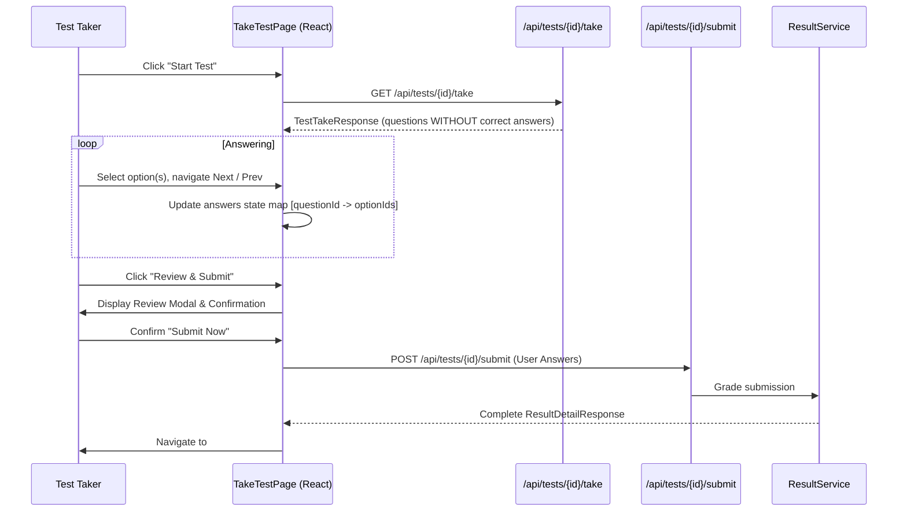

# Test Taking — Architecture

## Overview

The test-taking subsystem implements privacy-first delivery of test questions and robust client-side answer state management.

## Security & Sanitization

- Server-side DTO `TestTakeResponse` specifically strips out `correct_answers` and `explanation`.
- Inspecting network requests in browser DevTools reveals zero hints about which options are correct.
- Submission payload: `answers: list[UserAnswerSubmission]` where each entry is `{ question_id: str, selected_option_ids: list[str] }`.

## Client-Side State Management

- Answers stored in local React state keyed by `question_id: string[]`.
- Unsaved changes alert when attempting to navigate away before submission.

