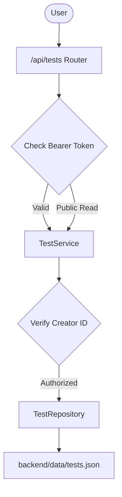

# Tests Authoring & Catalog — Architecture

## Overview

The tests subsystem manages test definition, question data structures, publication lifecycle, and ownership authorization.



## Data Models

```python
class QuestionType(str, Enum):
    SINGLE_CHOICE = "single_choice"
    MULTIPLE_CHOICE = "multiple_choice"
    TRUE_FALSE = "true_false"

class AnswerOption(BaseModel):
    id: str = Field(default_factory=lambda: str(uuid4()))
    text: str

class QuestionInDb(BaseModel):
    id: str = Field(default_factory=lambda: str(uuid4()))
    question_text: str
    question_type: QuestionType
    options: list[AnswerOption]
    correct_answers: list[str]  # Option IDs
    explanation: str = ""

class TestInDb(BaseModel):
    id: str = Field(default_factory=lambda: str(uuid4()))
    creator_id: str
    creator_username: str
    title: str
    description: str = ""
    category: str = "General"
    difficulty: str = "medium"  # easy | medium | hard
    questions: list[QuestionInDb] = []
    is_published: bool = False
    created_at: datetime
    updated_at: datetime
```

## Publishing Validation Rules

Before setting `is_published = True`, `TestService.publish_test()` executes:
1. `len(test.questions) > 0`
2. For each question:
   - `question_text.strip() != ""`
   - `len(question.options) >= 2`
   - `len(question.correct_answers) >= 1`
   - All `correct_answers` IDs must exist in `question.options`
   - If `single_choice` or `true_false`: `len(question.correct_answers) == 1`

## Frontend Components

- `TestEditorPage.tsx`: Dynamic form for title, description, category, difficulty, plus question builder (add question, select type, add/remove options, toggle correct answers, add explanation).
- `TestsCatalogPage.tsx`: Filterable grid of test cards with category pills and search input.
- `MyTestsPage.tsx`: Table view with Draft/Published badges and action buttons (Edit, Delete, Publish/Unpublish).

